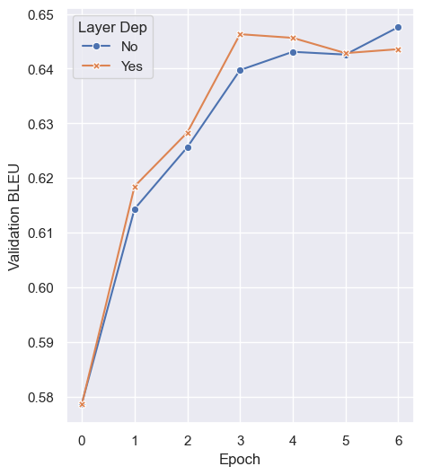

# Prompting Techniques for NLG in the Medical Domain

Generating automatic explanations for the predictions of machine learning models has
long since been a major challenge in Artificial Intelligence, especially when considering sensible domains like healthcare. In this thesis, we approach the problem of generating a fluent, natural language justification for a medical diagnosis given all the information in the case description and the disease's symptomatology. We treat this problem as a data-to-text task and solve it using prompting techniques for natural language generation. In particular, we propose two architectural modifications to standard Prefix Tuning called Layer Dependency and Prefix Pooling; we evaluate their results, comparing with current state-of-the-art methods for the data-to-text task, on both a general-purpose benchmark (WebNLG) and on a dataset of clinical cases and relative explanations built as part of the ANTIDOTE project. 

<p align="center">
   <br>
  Validation BLEU on WebNLG for model t5-base
</p>

Results show that layer dependency boosts the generation capabilities of our models when training on a limited computational budget, while Prefix Pooling is a valid dynamic prompting technique that achieves performances on par with the current state-of-the-art without requiring any additional information to be associated with the input. Finally, we note how, for our domain and in the context of the ANTIDOTE project, interpreting the explanation-generation task as data-to-text is a viable approach which produces high-quality justifications.

Note that all our experiments were tracked with Weigths & Biases and can be publicly accessed [here](https://wandb.ai/mwritescode/data2text-prompting).

## Requirements

The code has been tested with Python 3.10.4. <br>
In order to install the required python packages it's recommended to (i) create a virtual environment, (ii) install `torch` following the [official instructions](https://pytorch.org/), and (iii) simply run the below script to install the remaining requirements.
```sh
  pip install -U pip
  pip install -r requirements.txt
```

## Usage
In order to train and compute validation and test BLEU score of a model you can run
```sh
 python main.py path/to/your/config_file.yaml 
```
where `config_file.yaml` is a YACS configuration file following those in the [config folder](src/config/). Note that, if during training or evaluation you want to use wandb to log your metrics you also need to run `wandb login` before the commands above in order to login to your account.
